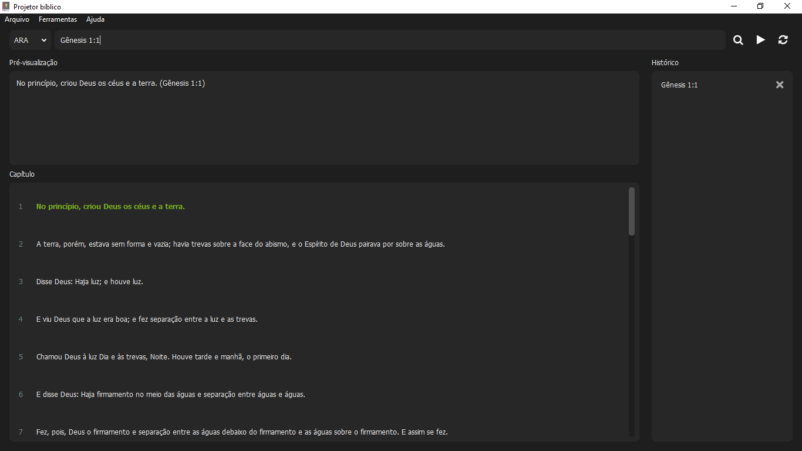

# Bible projector



> _Bible projector_ é um software de código aberto que visa projetar textos bíblicos instantaneamente no segundo monitor (caso houver).

### Ajustes e melhorias

O projeto ainda está em desenvolvimento e as próximas atualizações serão voltadas nas seguintes tarefas:

- [x] Projeção rápida de textos bíblicos através de referência.
- [x] Navegação fácil entre versículos (avançar e retroceder versículo no capítulo atual).
- [x] Pesquisa avançada, encontra versículos que correspondem ao trecho procurado.
- [x] Controle remoto (é possível controlar o software remotamente através de um aplicativo mobile conectado à mesma rede WI-FI).
- [ ] Encontrar versículos semelhantes ao procurado na pesquisa avançada.
- [ ] Possibilitar outros tipos de conexão remota com o aplicativo mobile (Bluetooth).

## 💻 Pré-requisitos

Antes de começar, verifique se você atendeu aos seguintes requisitos:

* Você instalou o [Python 3.10](https://www.python.org/);
* Você tem uma máquina `<Windows / Linux / Mac>`.

## 📥 Download

Se você estiver usando o Windows, baixe o zip do [GitHub Releases](https://github.com/devs-7/bible-projector/releases/latest), extraia e execute o arquivo `Projetor bíblico.exe`.

## 📦 Instalação

Instale as dependências:

```
pip install -r requirements.txt
```

## 📚 Utilização

Execute o seguinte comando:

```
python main.dev.py
```

## 📫 Contribuindo

Pull requests são sempre bem-vindos 😄.

Consulte a documentação do GitHub em [como criar uma solicitação pull](https://help.github.com/en/github/collaborating-with-issues-and-pull-requests/creating-a-pull-request).

## 📝 Licença

Esse projeto está sob licença. Veja o arquivo [LICENÇA](LICENSE) para mais detalhes.

[⬆ Voltar ao topo](#bible-projector)